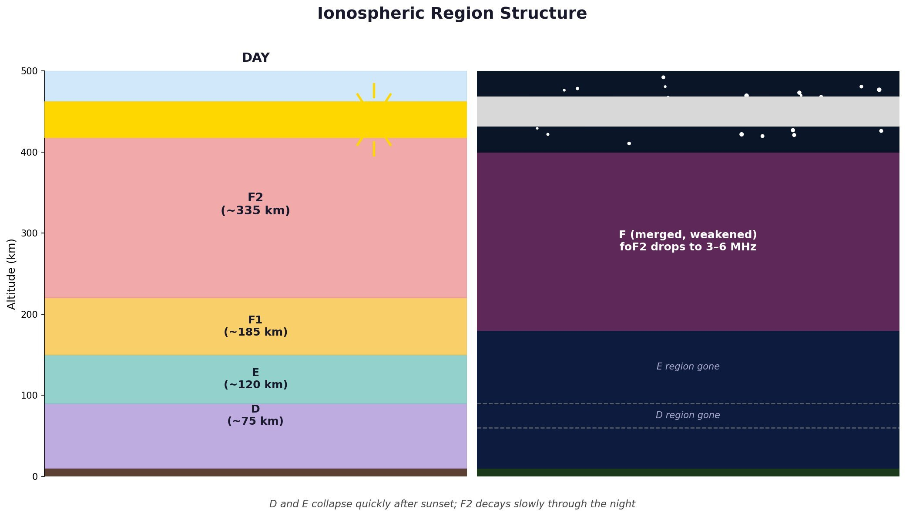
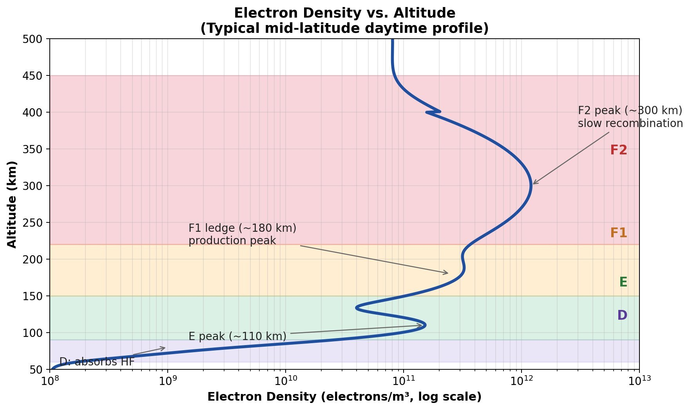
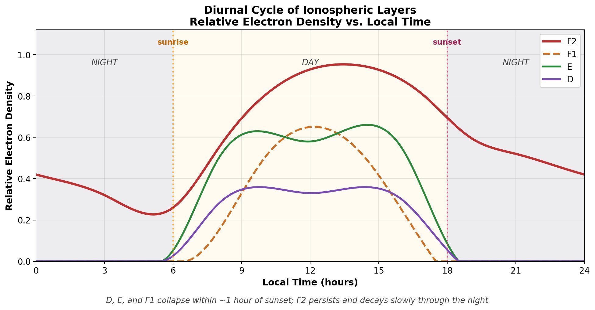

# The Ionosphere and HF Propagation

*A practical summary for Grape spectrogram interpretation*

*Ionospheric region structure during day and night. D, E, and F1 exist only during the day; F2 merges into a single weakened F layer at night.*

## Overview

The ionosphere is comprised of different regions which impact how HF radio waves propagate. During the day, the D, E, F1, and F2 regions are all present; at night, D, E, and F1 collapse rapidly, leaving only a single weakened F region.

## D Region (roughly 35–55 miles / 60–90 km up)

The lowest ionospheric region, and the only one that primarily *absorbs* HF rather than reflecting it. Formed by hard solar radiation — Lyman-alpha UV ionizing nitric oxide (NO), plus hard X-rays and galactic cosmic rays penetrating deep into the atmosphere.

At D region altitudes, the atmosphere is still relatively dense so electron density is modest but collision frequency is very high. When an HF wave passes through, electrons oscillate in the wave's electric field but immediately collide with neutral molecules, transferring the wave's energy into heat. The wave loses amplitude but isn't reflected. Absorption is strongest at lower frequencies (roughly proportional to 1/f²), which is why 80m and 160m go nearly dead during the day while 10m is barely affected.

The D region appears rapidly at sunrise as Lyman-alpha starts ionizing NO, peaks around local noon, and disappears quickly after sunset because recombination in the dense lower atmosphere is fast (time constants of minutes, similar to E). At night the D region is essentially gone, which is why lower HF bands suddenly open up after dark — signals that were being absorbed during the day can now reach E and F layers intact.

**Key disturbances tied to the D region:**

- **Sudden Ionospheric Disturbances (SIDs)** occur when solar X-ray flares drive extra ionization deep into the D region, dramatically increasing absorption and causing HF signals to fade or disappear on the sunlit hemisphere for minutes to hours — the classic "shortwave fadeout."
- **Polar Cap Absorption (PCA)** events result from solar proton events dumping high-energy protons into the polar D region, causing deep absorption on polar paths that can last days.
- **Auroral absorption** from energetic particle precipitation during geomagnetic storms ionizes the D region at auroral latitudes.

## E Region (roughly 60 miles / 90–150 km up)

Forms during the day when sunlight ionizes the upper atmosphere. The E region is dominated by molecular ions (O₂⁺ and NO⁺), which recombine rapidly through *dissociative recombination* — an electron joins the molecular ion and the molecule splits apart, carrying away the energy. Time constants are on the order of minutes, so the E region essentially switches off within half an hour to an hour after sunset. It can reflect HF signals up to around 20 MHz, covering distances up to about 1,200 miles (2,000 km) in a single hop. Because the layer sits at a stable height, Doppler shifts on a Grape spectrogram tend to be small and steady.

Sporadic-E is the interesting exception — dense patches that can suddenly appear, mostly in late spring and early summer with a smaller winter peak. These can reflect much higher frequencies (all the way into VHF on occasion) and produce strong, low and stable signals that sound almost local despite coming from hundreds of miles away.

## F Region (roughly 100–300 miles / 150–500 km up)

During the day, the F region splits into two parts called F1 and F2; at night they merge into a single F region. F2 is dominated by atomic ions (O⁺), which recombine *slowly* because the process requires two steps: the atomic ion must first react with a neutral molecule (N₂ or O₂) to form a molecular ion, which can then recombine with an electron. The bottleneck is the low density of neutral molecules at F layer altitude — there simply aren't many partners available — so time constants stretch out to hours rather than minutes.

This slow recombination is why F2 keeps working through the night, gradually weakening until dawn. Its critical frequency typically drops from 8–12 MHz during the day down to 3–6 MHz before sunrise, and when it falls below your operating frequency, the great circle path signal disappears. Critical frequency is the highest frequency reflected back to the earth's surface on a path perpendicular. F2 is the main region for long-distance HF, supporting the highest frequencies and single hops up to about 2,500 miles (4,000 km). It's also much more dynamic than E — Doppler shifts of ±1 Hz or more are common because the layer height moves around in response to solar heating, geomagnetic activity, and atmospheric waves called TIDs (Traveling Ionospheric Disturbances). Sunrise and sunset produce characteristic sharp Doppler spikes as the frequency-dependent layer reflection height within the layer rapidly changes height.

*Electron density vs. altitude showing the characteristic peaks of the D, E, F1, and F2 regions. F1 is a ledge rather than a true peak during most conditions.*

## Why F Splits into F1 and F2

F1 and F2 aren't separate regions of different material — they're two peaks in one continuous electron density profile. Solar UV production peaks at one altitude (where absorption is strongest, around 90–120 miles / 150–200 km up), while the two-step recombination loss rate depends on neutral density, which falls off exponentially with altitude. These two effects don't align neatly, producing a local dip between two peaks: the lower F1 ledge (driven by strong production) and the upper F2 peak (sustained by slow loss plus upward plasma transport along magnetic field lines). F1 only exists during the day because it needs active sunlight. F2 persists overnight because its O⁺ plasma recombines so slowly.

F2 has some well-known quirks: its peak often comes after local noon rather than at noon, mid-latitude foF2 can actually be higher in winter than summer (driven by seasonal changes in the O/N₂ ratio that affect loss rates), and there's an unusual double-peak structure around the magnetic equator.

*Schematic diurnal cycle of each layer. D, E, and F1 are daytime-only and collapse rapidly after sunset, while F2 persists through the night, gradually decaying until sunrise.*

## What You See on a Grape Spectrogram

The fast E / slow F2 recombination asymmetry explains the whole daily cycle:

- At sunset, E drops out quickly as molecular ions neutralize within minutes, while F2 lingers because O⁺ has no fast loss path.
- Overnight, only F2 remains, showing slow wavy Doppler patterns from TIDs.
- Before dawn, F2 can decay enough to lose the signal entirely.
- At sunrise, the F layer rebuilds rapidly on top of whatever plasma survived the night, producing the dramatic Doppler spike that is the most distinctive feature on most Grape plots.
- During the day you often see both E and F contributing simultaneously.

On a Grape display, the E trace is steadier and closer to zero Doppler; the F trace is more active with wave-like wiggles. F1 is rarely visible on 10 MHz because it reflects lower frequencies.

**Distinguishing real SIDs from receiver overload:** A genuine SID appears as a smooth, broadband amplitude fade (often with an associated Doppler excursion from rapid F layer contraction) lasting minutes to hours. Receiver mixer overload from strong signals produces spiky, vertical streaks in the spectrogram that coincide with strong-signal arrival times — these are artifacts, not propagation features. If the spikes appear suddenly at sunrise when WWV comes booming in and disappear at sunset, suspect overload rather than space weather.

## Further Reading

- Davies, K. (1990). *Ionospheric Radio*. The classic reference for HF propagation and ionospheric physics. [Available at archive.org](https://archive.org/details/IonosphericRadioPropagation)
- Eddy, J. (2010). *The Sun, The Earth and Near Earth Space: A Guide to the Sun-Earth System.* Useful but less technical description of space weather and its ramifications. [Available at archive.org](https://archive.org/details/sunearthneareart0000eddy)
- Silver, W. (2023). *Here to There: Radio Wave Propagation.* ARRL Practical guide to understanding what's going on in the ionosphere and radio wave propagation.
